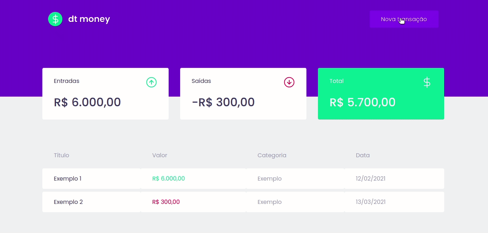

# DT money :money_with_wings:

Aplicação criada durante o Chapter II do Ignite na trilha de React JS da Rocketseat. 

Seu objetivo é ser uma página de acompanhamento financeiro, através de resumo e listagem de transações de entrada e saída, além de apresentar o saldo total de acordo com o que foi cadastrado. 

## Resultados

    

## Detalhamento do que foi aprendido

> **Em construção...** :woman_technologist: :sparkles:

## Como rodar o projeto?

1. Faça download do projeto
2. Entre no diretório do projeto pelo terminal
3. Rode os comandos `yarn` e `yarn start`
4. Acesse http://localhost:3000/ 

    Made with ☕ & &#128156; by <strong>Eirene</strong>

